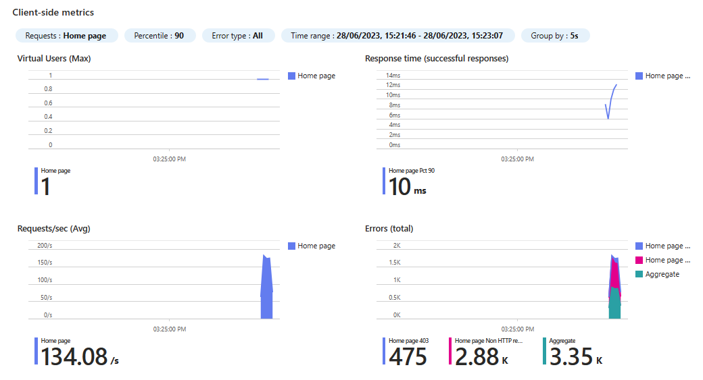
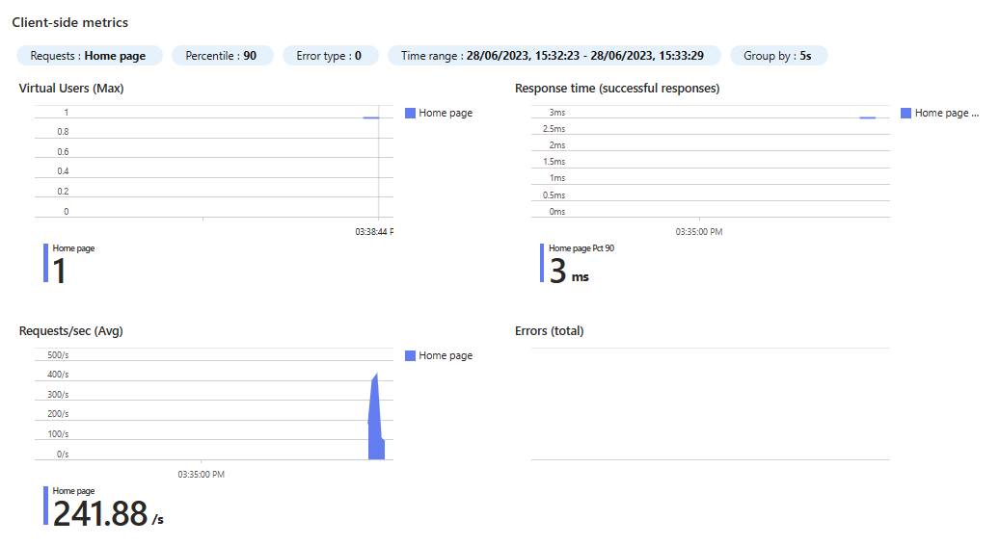

# Test Azure Load Testing with public service with access restrictions

The following example shows how to test a public service with access restrictions using Azure Load Testing. 
This scenario is described in the [Azure Load Testing documentation](https://learn.microsoft.com/en-us/azure/load-testing/concept-azure-load-testing-vnet-injection#scenario-load-test-a-public-endpoint-with-access-restrictions).

## Create the demo app

```bash
dotnet new webapp -n MyFirstAzureWebApp --framework net7.0
```

## Deploy demo app in App service

```bash	
export APP_NAME=app-$(uuidgen | cut -c1-5)
export RG_NAME=test-load-testing-rg
export PLAN_NAME=plan-$APP_NAME
export SKU=P1V2
export LOCATION=northeurope
```

## Create a resource group

```bash
az group create -n $RG_NAME -l $LOCATION
```

## Deploy app

```bash
cd MyFirstAzureWebApp
az webapp up -n $APP_NAME -g $RG_NAME -p $PLAN_NAME --sku $SKU --location $LOCATION 
```

## Add access restrictions

Gather your public IP in order to limit access only from your laptop ([You can use this site](https://whatismyipaddress.com/)). Set it in the IP variable and add the access restriction:

```bash
IP=<your_ip>
az webapp config access-restriction add -n $APP_NAME -g $RG_NAME --rule-name home --action Allow --ip-address $IP --priority 200
```

Test you can access from your laptop.

## Prepare load test environment

### Create Vnet and Subnet
    
```bash
az network vnet create \
    --name vnet-$APP_NAME \
    --resource-group ${RG_NAME} \
    --location ${LOCATION} \
    --address-prefixes 10.0.0.0/8

az network vnet subnet create \
    --vnet-name vnet-$APP_NAME \
    --name subnet1-$APP_NAME \
    --resource-group ${RG_NAME} \
    --address-prefixes 10.1.0.0/16
```

### Create a NAT Gateway

```bash
az network public-ip create \
    --name pip-nat-gateway-$APP_NAME \
    --resource-group ${RG_NAME} \
    --location ${LOCATION} \
    --sku Standard

az network nat gateway create \
    --name nat-gateway-$APP_NAME \
    --resource-group ${RG_NAME} \
    --location ${LOCATION} \
    --idle-timeout 10 \
    --public-ip-address pip-nat-gateway-$APP_NAME 
```

### Assign to subnet

```bash
az network vnet subnet update \
    --name subnet1-$APP_NAME \
    --resource-group ${RG_NAME} \
    --vnet-name  vnet-$APP_NAME \
    --nat-gateway nat-gateway-$APP_NAME
```

## Deploy load test instance
    
```bash
az load create --name load-test-$APP_NAME --location $LOCATION --resource-group $RG_NAME
```
## Create test

Get the app domain and save it to a variable:

```bash
export APP_DOMAIN=`az webapp show -n $APP_NAME -g $RG_NAME --query defaultHostName --output tsv`
```

Create final .jmx file:

```bash
cat jmeter/test-template.jmx | envsubst > jmeter/test.jmx
```

Create a test injecting the subnet we created before:

```bash
export SUBSCRIPTION_ID=$(az account show --query id --output tsv)
export ID=$(uuidgen | cut -c1-5)
az load test create --load-test-resource  load-test-$APP_NAME -g $RG_NAME \
    --test-id  load-test-$APP_NAME-$ID --display-name "load-test-${APP_NAME}-${ID}" \
    --description "Created using Az CLI for test load-test-${APP_NAME}-${ID}" \
     --subnet-id  "/subscriptions/${SUBSCRIPTION_ID}/resourceGroups/$RG_NAME/providers/Microsoft.Network/virtualNetworks/vnet-${APP_NAME}/subnets/subnet1-${APP_NAME}" \
    --test-plan jmeter/test.jmx --engine-instances 1
```

Run the test:

```bash
export RUN_ID=$ID""`date +"%Y%m%d%_H%M%S"`
az load test-run create --load-test-resource load-test-$APP_NAME  --test-id load-test-$APP_NAME-$ID \
  --test-run-id $RUN_ID --display-name $RUN_ID --description "Test run from CLI" --resource-group $RG_NAME
```

Verify that the test failed with 403.. as the IP address of the NAT Gateway is not allowed yet.

In the portal, you can see the test run and the error:



## Add the NAT Gateway IP to the access restrictions

```bash
export NAT_IP=`az network public-ip show -n pip-nat-gateway-$APP_NAME -g $RG_NAME --query ipAddress --output tsv`
az webapp config access-restriction add -n $APP_NAME -g $RG_NAME --rule-name nat --action Allow --ip-address $NAT_IP --priority 100
```

Run the test again:

```bash
export RUN_ID=$ID""`date +"%Y%m%d%_H%M%S"`
az load test-run create --load-test-resource load-test-$APP_NAME  --test-id load-test-$APP_NAME-$ID \
  --test-run-id $RUN_ID --display-name $RUN_ID --description "Test run from CLI" --resource-group $RG_NAME
```

You should now see the test run successfully:


